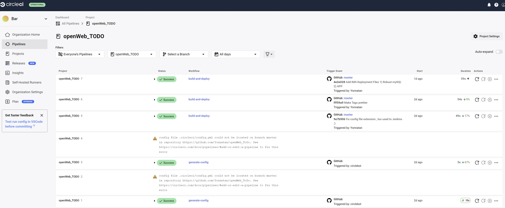
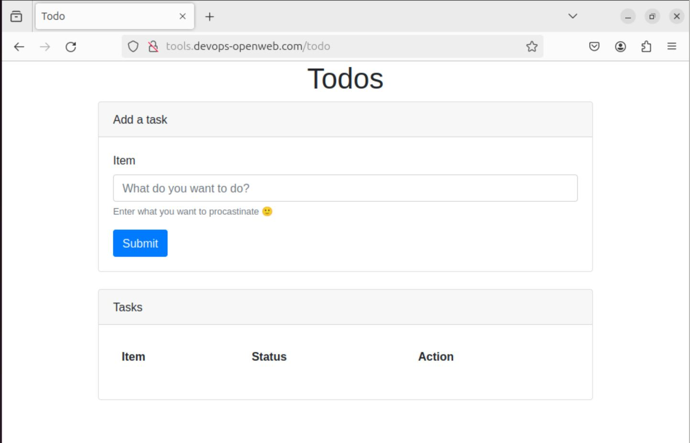

# Go Todo - Now in Dockerized flavor

## Requierments

1. Original project taken from https://github.com/SpotIM/devops-exercise-todo-go

2. The app should run in a container, as small as possible.

3. The CI process should be executed in CircleCI, the image should be pushed to Docker
hub (CircleCI project and Dockerhub repo should exist for the assessment check and
can be deleted afterwards of course).

4. The app should be highly available, to voluntary disruption as well and deployed to
Kubernetes (push all the K8s manifests to a single folder in the solution repo, they
will be tested manually with kubectl apply so they should work as is).

5. The app requires a MySQL database that should be durable.

6. The app should be available at tools.devops-openweb.com/todo (use /etc/hosts, no
need to register a domain, provide a script that will insert the correct values and IP
address).

7. The solution repository should contain a readme explaining the CICD flow in detail.

## Solution

2. Please find Multi-Stage Dockerfile in the root of this repository

3. Please find Pipeline in ./circleci/config.yml 
 
Image can be found in : 
https://hub.docker.com/repository/docker/coffee2code/openweb-todo/general

4. Kubectl files located in /deployment folder , numbered for execution order (dependancy requierment)
HA - Multiple replicas + AntiAffinity are set in todo-deployment.yaml 

5. mysql deployment included in the folder 
Durability - mysql will run with persistant volume. 

6. To leave it simple Instead of using ingress controlelr I just implemented Nginx Reverse proxy 
to redirect <URL>/todo requests to <todo-app-service>:4040 .

7. See below :

## SETUP 
## CI 
1. Build and push the Docker Image (Can be done Manually using Docker Build , or Just Setup a project in CircleCI using the attached config)

## CD
1. Verify your Image is updated in /deployment/todo-deployment.yaml (Or just use the default image already there)
2. kubectl apply -f ./deployment 
3. execute ./deployment/50-update_hosts.sh 
4. profit. 
 

